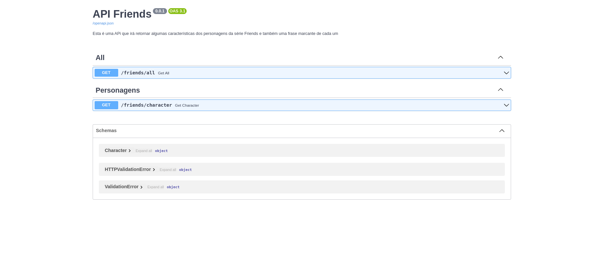

# Como rodar este projeto:


Este projeto utiliza Python3.11 e Sqlite3

É aconselhável a utilização de um ambiente virtual Python. Para criar o ambiente virtual, rode o seguite comando:   

```plaintext
python3.11 -m venv venv

source venv/bin/activate
```
Em seguida instale as dependências do projeto:
```plaintext
pip install -r requirements.txt
```
Pronto! O ambiente virtual foi criado e as depedências foram instaladas. 


Para rodar o projeto, faça:
```plaintext
python app.py
```

A documentação pode ser acessada no endpoint "/docs"


